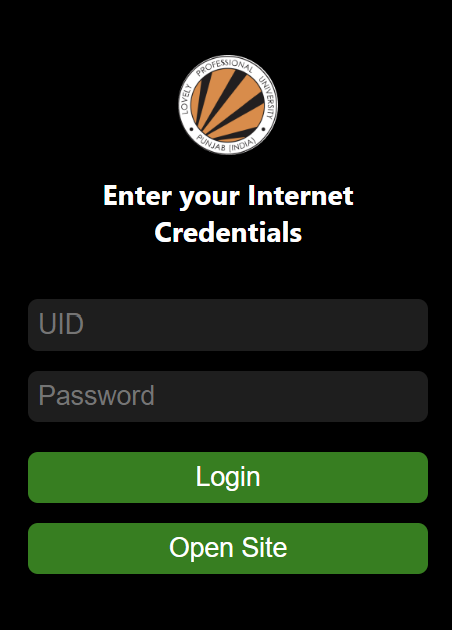

# LPU-Internet-Assist
> Comes in two flavours with UI and without UI.


### With UI (for normal people) 📱💻

1. Enter the creds in the extension (only needed the first time).
2. Once you are on the correct site just press `Login` in the extension and it does all for you.
3. Simply, open `chrome://extensions` and open the developer mode.
4. Use **Load Unpacked** and select the UI Folder.

   
### Without UI (for devs) 🧑‍💻

1. Simply download the code as zip and extract it.
2. Once extracted open the file `/NO-UI/background.js` in VSCode.
3. Add your `reg_no` and `internet_password` as mentioned in the `TODO's`.
```js
  const userNameFields = document.getElementsByName("username");
  if (userNameFields.length > 0) {
    // TODO: 1 Enter your registration number
    userNameFields[0].value = "your_reg_no";
  }

  const passwordFields = document.getElementsByName("password");
  if (passwordFields.length > 0) {
    // TODO: 2 Enter your Internet password
    passwordFields[0].value = "your_password";
  }
```
4. Simply, open `chrome://extensions` and open the developer mode.
5. Use **Load Unpacked** and select the No-UI Folder.
